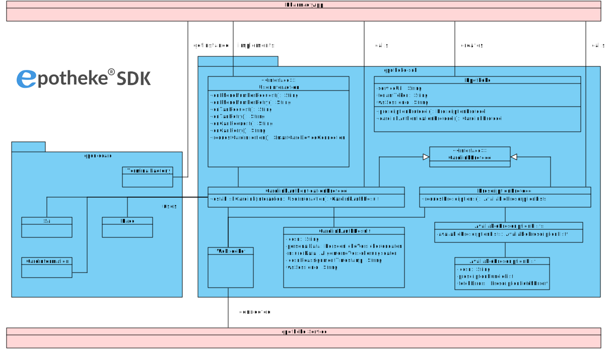

# epotheke-SDK

The epotheke SDK is a Kotlin Multi-Platform (KMP) library implementing the client side of the [CardLink](https://www.epotheke.com/#eH-CL) protocol.
It takes care of the communication with the CardLink service and the handling of the eHealth card.

Demo applications for native android and ios apps can be found in folders: 
- [demo-android-standalone](demo-android-standalone)
- [demo-ios-standalone](demo-ios-standalone)

The latest documentation can be found at https://mvn.ecsec.de/repository/data-public/epotheke/sdk/doc/latest/.

## App Integration

The epotheke SDK provides an API which can be integrated directly using the `Epotheke` class.

`Epotheke` class needs as parameters:
- The service url
- A tenant token for access to the service
- An optional `websocketSessionId` to reconnect to an existing session.
- An instance of `AndroidTerminaFactory` for NFC communication

`AndroidTerminaFactory` can be gathered by calling `AndroidTerminalFactory.instance(activity)` providing a reference to the android activity.
`IosTerminalFactory` by IosTerminalFactory.companion.instance.

An instance of `Epotheke` class provides instances of: 
- `CardlinkAuthenticationProtocol`
- `PrescriptionProtocol`
 
which can be used to perform different functions.
 
`CardlinkAuthenticationProtocol` allows to call `establishCadrlink(interaction)` which performs an authentication process 
with epotheke using SMS/Tan verification and an eGK card. `interaction` has to be an implementation of `CardlinkInteraction` interface.
This instance of `CardlinkInteraction` enables the protocol to get needed data and inform calling code about current steps.
Since it is implemented by a consumer of the sdk, it has full control of how the process is presented to the user etc.

`PrescriptionProtocol` allows to call `requestPrescriptions()` which fetches available Prescriptions for registered eGK cards in the session.

Note: On android a consuming app hast to ensure that intents in `onNewIntent()` function is handed to the `AndroidTerminalFactory` to allow 
reading eGK cards via NFC. Filtering for appropriate tags and switching managing the NFC stack is done in the sdk.

For details on how to configure your app project, refer to the [manual](https://mvn.ecsec.de/repository/data-public/epotheke/sdk/doc/latest/).




## Building the SDK
```bash
./gradlew build
```

In order to build the SDK for use in an app, it can be published to the local maven repository with the following command:
```bash
./gradlew publishToMavenLocal
```
After successful execution of the command, the SDK can be used as shown in the demo application.

## License

The epotheke SDK uses a Dual Licensing model.
The software is always distributed under the GNU General Public License v3 (GPLv3).
Additionally, the software can be licensed in an individual agreement between the licenser and the licensee.
