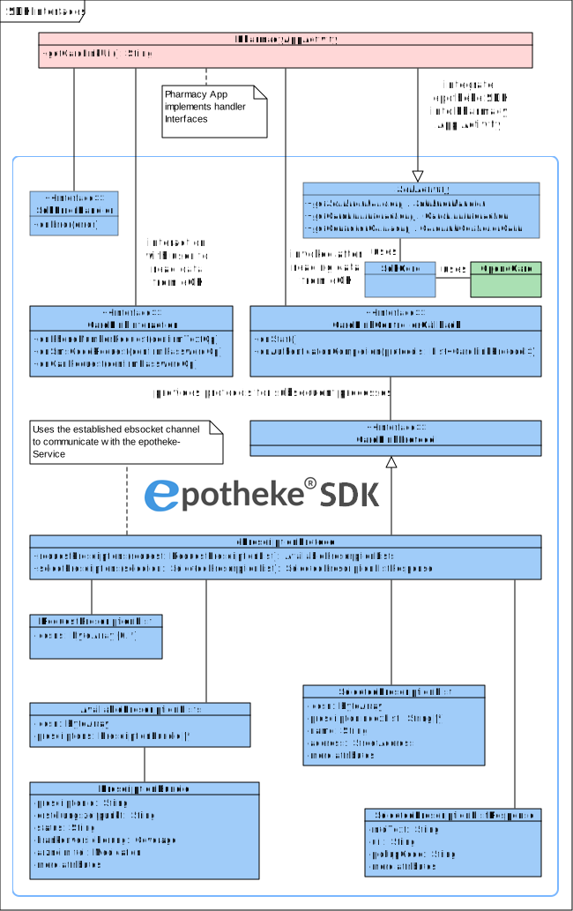

# epotheke-SDK

The epotheke SDK is a Kotlin Multi-Platform (KMP) library implementing the client side of the [CardLink](https://www.epotheke.com/#eH-CL) protocol.
It takes care of the communication with the CardLink service and the handling of the eHealth card.

A simple android demo application can be found in the [demo-android-standalone](demo-android-standalone) folder.
iOS support will follow in a successive release.

The latest documentation can be found at https://mvn.ecsec.de/repository/data-public/epotheke/sdk/doc/latest/.


## App Integration

The epotheke SDK provides an API which can be integrated directly using the `SdkCore` class.
To eliminate the need to write platform specific glue code, there are platform specific classes, which can be used instead.
On Android, the `SdkActivity` can be extended, so only the App specific interaction handlers need to be implemented.

The epotheke SDK contains three handlers, that need to be implemented:
- `SdkErrorHandler` for handling errors related to the SDK initialisation
- `CardLinkInteraction` for exchanging data between the user and the CardLink service
- `CardLinkControllerCallback` for providing the CardLink result and protocols for subsequent processes (e.i. Prescription retrieval/selection)

For details on how to configure your app project, refer to the [manual](https://mvn.ecsec.de/repository/data-public/epotheke/sdk/doc/latest/).




## Building the SDK

Before building the SDK, it is necessary to setup the android SDK either [directly](https://developer.android.com/tools/sdkmanager) or together with [Android Studio](https://developer.android.com/studio).
Make sure to set the `ANDROID_HOME` variable as explained [here](https://developer.android.com/tools/variables).

In order to build the SDK for use in an app, it can be published to the local maven repository with the following command:
```bash
./gradlew publishToMavenLocal
```
After successful execution of the command, the SDK can be used as shown in the demo application.
The version of the SDK is defined in the [gradle.properties](gradle.properties) file.


## License

The epotheke SDK uses a Dual Licensing model.
The software is always distributed under the GNU General Public License v3 (GPLv3).
Additionally, the software can be licensed in an individual agreement between the licenser and the licensee.
